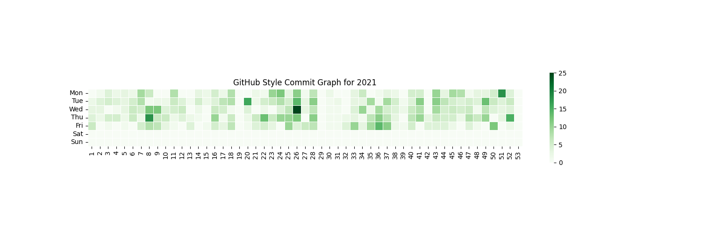

# GitHub-Style Commit Graph Generator 📊

## Overview 🌟

This tool empowers developers using Bitbucket, GitLab, or other version control platforms to generate a GitHub-style commit graph. It visualizes a user's commit activity over a year and can be integrated into GitHub as a visually appealing badge, showcasing a developer's dedication and consistency.




## Features 🔥

- Create a detailed heatmap resembling GitHub's contribution graph
- Analyze and visualize commit history from any local git repository
- Interactive CLI for ease of use and quick generation

## Getting Started 🚀

### Using gitGraph from Dist/Release 📦

For quick use without delving into the code:

1. Download the latest executable from the `dist` or `Releases` section of this repository.
2. Run the executable and follow the on-screen prompts to generate your commit graph.

### Contributing to gitGraph 🛠️

If you're interested in contributing to the codebase:

1. Fork and clone the repository.
2. Install the required dependencies:
   ```shell
   pip install -r requirements.txt
   ```
3. Run `git_graph.py` to modify or enhance functionality.
4. Create a pull request with your proposed changes.

## Usage 📝

To generate your commit graph:

1. Navigate to the `dist` directory.
2. Run the `gitGraph` executable.
3. Provide the requested information (email, year, and repository path).

The script will output a heatmap visualizing your commits for the specified year.


## Future Plans 💭

- Streamline the badge generation for live updating on GitHub profiles.
- Enhance the visualization with more customization options.

## License 📄

This project is licensed under the MIT License - see the `LICENSE` file for details.

## Contact 📧

- Your Name - [yakin.rubaiat@gmail.com](yakin.rubaiat@gmail.com)
- Project Link: [https://github.com/YakinRubaiat/GitGraph](https://github.com/YakinRubaiat/GitGraph)
